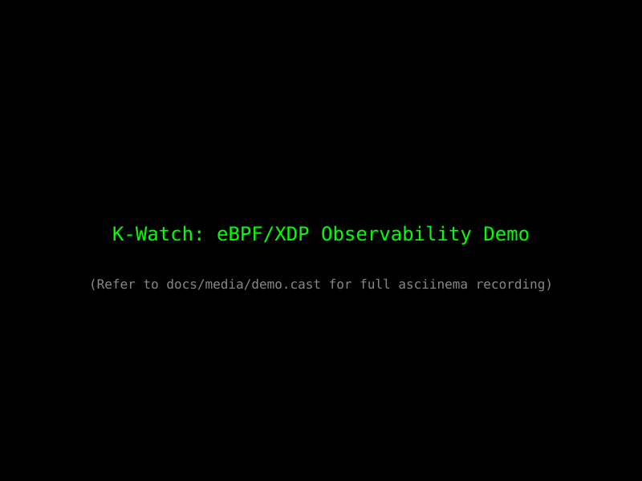

# K-Watch: eBPF Kernel Observability Engine



K-Watch is a high-performance network monitoring and filtering tool powered by eBPF (XDP). It injects code directly into the Linux kernel to process packets at the driver level, providing deep visibility and line-rate mitigation without the overhead of traditional userspace tools.

K-Watch is designed as a focused demonstration of eBPF/XDP depth, featuring ring-buffer event streaming, behavioral SYN-flood detection, and CIDR-based hardware-offload ready filtering. It is **not** a production IDS or WAF; it is a systems engineering showcase.

## Architecture
See [docs/architecture.md](docs/architecture.md) for a detailed breakdown.

NIC → XDP (Parser & Filter) → BPF Maps → Ring Buffer → C++ Daemon → CLI/TUI

## Quickstart

### 1. Build
```bash
cmake -B build
cmake --build build
```

### 2. Run
Observe live traffic on your loopback interface:
```bash
sudo ./build/kwatch run lo
```

### 3. Mitigate
Block an IP or entire range instantly:
```bash
sudo ./build/kwatch block lo 1.2.3.4/32
```

## Features

- **XDP-Powered**: High-performance packet processing at the driver level.
- **Behavioral Detection**: Detects SYN floods using SYN/ACK ratio analysis.
- **Auto-Mitigation**: Automatically blocks malicious IPs with a configurable cooldown.
- **Single Binary**: No Node.js, Python, or external runtimes. Pure C++20 and libbpf.
- **Interactive TUI**: Opt-in dashboard via `kwatch top`.
- **CO-RE**: Portable across different kernel versions without recompilation.

## Detailed Documentation

- [Architecture & Data Path](docs/architecture.md)
- [Design: Behavioral Detection](docs/design/behavioral-detection.md)
- [Design: CO-RE & Portability](docs/design/co-re.md)
- [Design: XDP Attach Modes](docs/design/xdp-attach-modes.md)
- [Performance Benchmarks](docs/perf.md)
- [Exit Codes](docs/exit-codes.md)

## License
MIT
