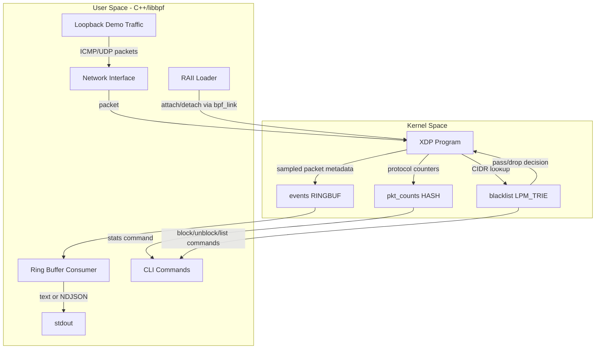

# K-Watch Architecture

K-Watch follows a small "kernel fast path, userspace control path" design. The XDP program performs packet parsing and map updates in kernel space. The C++ process owns the BPF lifecycle, drains sampled events, exposes a narrow CLI for observation and blacklist control, and can generate bounded loopback demo traffic.

## Components

### XDP Program

`bpf/kwatch.bpf.c` is the kernel entry point. It parses Ethernet, one VLAN tag, IPv4, TCP, UDP, and ICMP. IPv6 and ARP are count-only sentinel paths. The program updates protocol counters, checks the CIDR blacklist, and writes sampled event metadata to the ring buffer.

### BPF Maps

- `pkt_counts`: protocol counters used by `kwatch stats`.
- `blacklist`: an `LPM_TRIE` map so `kwatch block` can handle CIDR ranges.
- `events`: a ring buffer for sampled packet metadata consumed by `kwatch run`.
- Additional maps may exist for sampling or future analysis, but they are not part of the required architecture contract.

### Userspace Loader

The C++ loader owns the generated libbpf skeleton, XDP link, ring buffer, and file descriptors through RAII wrappers. Attach mode defaults to drv -> skb -> generic fallback, while explicit `--xdp-mode` values skip fallback.

### CLI Boundary

`kwatch run <iface>` is the long-running owner of the active maps. `stats`, `block`, `unblock`, and `list` operate against maps pinned by that running instance. If no active maps exist for the interface, those commands fail cleanly with exit code 65.

### Demo Traffic

`kwatch demo ping-flood` and `kwatch demo udp-storm` provide bounded, loopback-safe proof traffic. They exist so a reviewer can see the XDP path produce events and counters without installing external traffic tools. They are not benchmarks and they are not attack tooling.

## Optional Work

A TUI, behavioral SYN detection, auto-blocking, and performance benchmark suite are future enhancements. They are intentionally outside the required v1.0 portfolio architecture.
