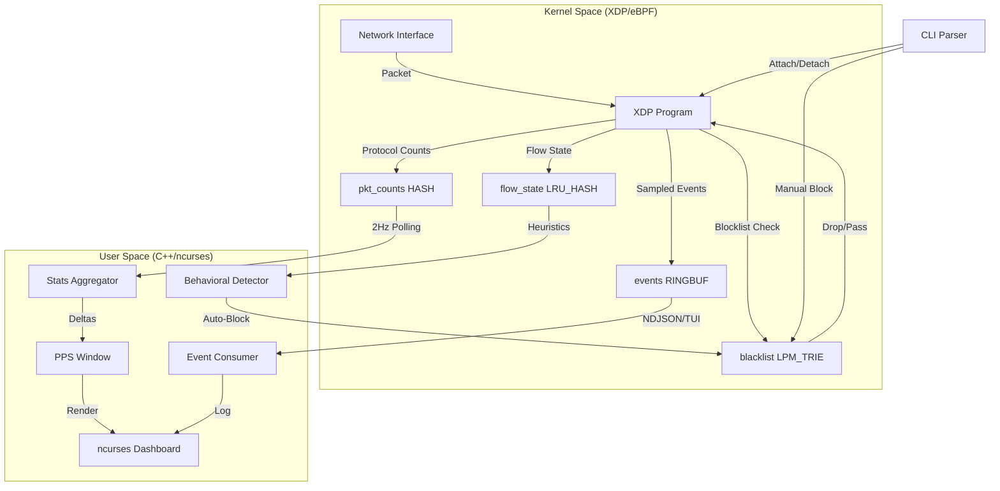

# K-Watch Architecture

K-Watch follows a "Thick Kernel, Thin Userspace" design pattern. Most of the high-frequency packet processing happens in the XDP layer, while the userspace process acts as a low-frequency observer and controller.

## Key Components

### 1. XDP Program (`bpf/kwatch.bpf.c`)
The high-performance entry point. It parses Ethernet, VLAN, IPv4, TCP, UDP, and ICMP. It performs the LPM Trie lookup for the blacklist and samples new flows into the ring buffer.

### 2. Behavioral Detector (`src/core/flow_tracker.cpp`)
Calculates SYN/ACK ratios and OS heuristics based on the `flow_state` map. It implements the auto-mitigation logic (R4.2).

### 3. TUI (`src/tui/app.cpp`)
A single-binary interactive dashboard using `ncurses`. It visualizes the kernel state without introducing external dependencies like Node.js or Python.

### 4. RAII Lifecycle (`src/bpf/skeleton.cpp` & `attach.cpp`)
Uses `bpf_link` to ensure that the kernel automatically detaches the BPF program if the userspace process crashes or is killed, maintaining system stability.
